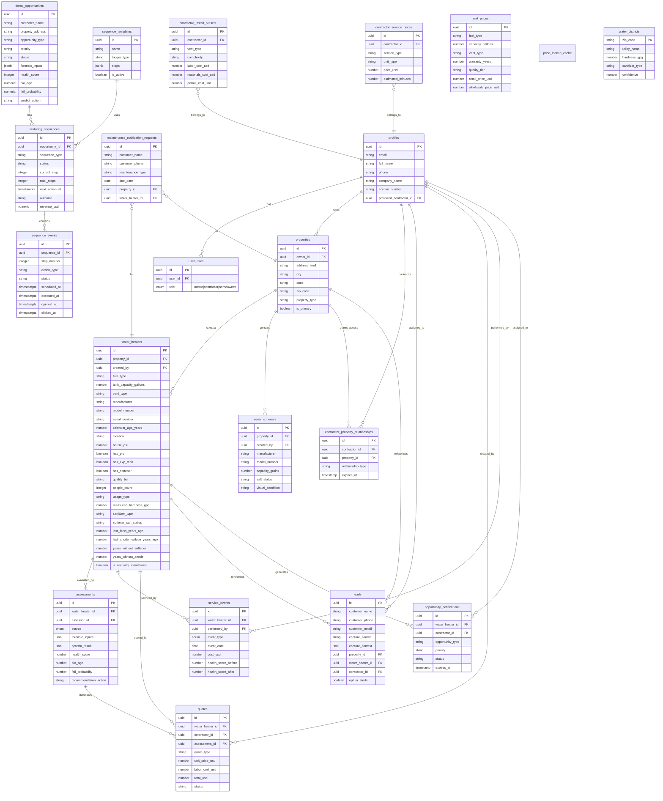

# Backend Architecture Documentation

> Comprehensive technical reference for the Opterra Water Heater Platform backend systems.

## Table of Contents

1. [Architecture Overview](#architecture-overview)
2. [Database Schema & Relationships](#database-schema--relationships)
3. [Edge Functions Reference](#edge-functions-reference)
4. [Data Flow Diagrams](#data-flow-diagrams)
5. [Offline Sync Architecture](#offline-sync-architecture)
6. [Frontend-Backend Integration](#frontend-backend-integration)
7. [Type Mappers Reference](#type-mappers-reference)
8. [Security Model](#security-model)
9. [Environment & Secrets](#environment--secrets)
10. [Common Patterns & Best Practices](#common-patterns--best-practices)

---

## Architecture Overview

### System Diagram


### Technology Stack

| Layer | Technology | Purpose |
|-------|------------|---------|
| **Frontend** | React 18 + Vite | UI framework and build tool |
| **Styling** | Tailwind CSS + shadcn/ui | Component library and styling |
| **State** | React Query + useState | Server and local state management |
| **Offline** | IndexedDB (idb) | Offline data persistence |
| **Backend** | Supabase (Lovable Cloud) | Database, auth, edge functions |
| **AI** | Lovable AI Gateway | Vision and content generation |
| **Database** | PostgreSQL 15 | Relational data storage |

---

## Database Schema & Relationships

### Entity Relationship Diagram



---

### Table Schema Details

Complete column-level schema for all database tables.

#### `profiles`

| Column | Type | Nullable | Default | Description |
|--------|------|----------|---------|-------------|
| `id` | `uuid` | No | - | Primary key, matches auth.users.id |
| `email` | `text` | Yes | - | User email address |
| `full_name` | `text` | Yes | - | Display name |
| `phone` | `text` | Yes | - | Contact phone |
| `avatar_url` | `text` | Yes | - | Profile image URL |
| `company_name` | `text` | Yes | - | Contractor company name |
| `license_number` | `text` | Yes | - | Contractor license |
| `service_area` | `jsonb` | Yes | - | Geographic service area |
| `preferred_contractor_id` | `uuid` | Yes | - | FK to preferred contractor profile |
| `created_at` | `timestamptz` | No | `now()` | Record creation time |
| `updated_at` | `timestamptz` | No | `now()` | Last update time |

#### `user_roles`

| Column | Type | Nullable | Default | Description |
|--------|------|----------|---------|-------------|
| `id` | `uuid` | No | `gen_random_uuid()` | Primary key |
| `user_id` | `uuid` | No | - | FK to auth.users |
| `role` | `app_role` | No | - | Enum: `admin`, `contractor`, `homeowner` |
| `created_at` | `timestamptz` | No | `now()` | Role assignment time |

#### `properties`

| Column | Type | Nullable | Default | Description |
|--------|------|----------|---------|-------------|
| `id` | `uuid` | No | `gen_random_uuid()` | Primary key |
| `owner_id` | `uuid` | No | - | FK to profiles.id |
| `address_line1` | `text` | No | - | Street address |
| `address_line2` | `text` | Yes | - | Unit/apt number |
| `city` | `text` | No | - | City name |
| `state` | `text` | No | - | State code |
| `zip_code` | `text` | No | - | ZIP code |
| `property_type` | `text` | Yes | `'single_family'` | Property category |
| `year_built` | `integer` | Yes | - | Construction year |
| `square_footage` | `integer` | Yes | - | Property size |
| `is_primary` | `boolean` | Yes | `true` | Primary residence flag |
| `created_at` | `timestamptz` | No | `now()` | Record creation time |
| `updated_at` | `timestamptz` | No | `now()` | Last update time |

#### `water_heaters`

| Column | Type | Nullable | Default | Description |
|--------|------|----------|---------|-------------|
| `id` | `uuid` | No | `gen_random_uuid()` | Primary key |
| `property_id` | `uuid` | No | - | FK to properties |
| `created_by` | `uuid` | Yes | - | FK to profiles (installer) |
| `manufacturer` | `text` | Yes | - | Brand name |
| `model_number` | `text` | Yes | - | Model identifier |
| `serial_number` | `text` | Yes | - | Serial number |
| `fuel_type` | `text` | No | `'GAS'` | `GAS`, `ELECTRIC`, `PROPANE` |
| `tank_capacity_gallons` | `integer` | No | `50` | Tank size |
| `vent_type` | `text` | Yes | `'ATMOSPHERIC'` | `ATMOSPHERIC`, `POWER_VENT`, `DIRECT_VENT` |
| `quality_tier` | `text` | Yes | `'STANDARD'` | `STANDARD`, `PREMIUM`, `LUXURY` |
| `warranty_years` | `integer` | Yes | `6` | Warranty duration |
| `install_date` | `date` | Yes | - | Installation date |
| `calendar_age_years` | `numeric` | Yes | - | Calculated age |
| `location` | `text` | Yes | `'GARAGE'` | Installation location |
| `temp_setting` | `text` | Yes | `'NORMAL'` | Temperature setting |
| `building_type` | `text` | Yes | `'residential'` | Building category |
| `house_psi` | `numeric` | Yes | - | Water pressure |
| `street_hardness_gpg` | `numeric` | Yes | - | Water hardness |
| `has_softener` | `boolean` | Yes | `false` | Softener present |
| `has_prv` | `boolean` | Yes | `false` | Pressure reducing valve |
| `has_exp_tank` | `boolean` | Yes | `false` | Expansion tank present |
| `exp_tank_status` | `text` | Yes | - | Expansion tank condition |
| `has_circ_pump` | `boolean` | Yes | `false` | Recirculation pump |
| `is_closed_loop` | `boolean` | Yes | `false` | Closed loop system |
| `has_drain_pan` | `boolean` | Yes | `false` | Drain pan present |
| `is_finished_area` | `boolean` | Yes | `false` | Finished basement/area |
| `is_leaking` | `boolean` | Yes | `false` | Active leak detected |
| `leak_source` | `text` | Yes | - | Leak origin point |
| `visual_rust` | `boolean` | Yes | `false` | Visible rust/corrosion |
| `anode_count` | `integer` | Yes | `1` | Number of anode rods |
| `connection_type` | `text` | Yes | - | Pipe connection type |
| `gas_line_size` | `text` | Yes | - | Gas line diameter |
| `room_volume_type` | `text` | Yes | - | Installation space size |
| `venting_scenario` | `text` | Yes | - | Venting configuration |
| `rated_flow_gpm` | `numeric` | Yes | - | Tankless flow rate |
| `air_filter_status` | `text` | Yes | - | Tankless air filter |
| `inlet_filter_status` | `text` | Yes | - | Tankless inlet filter |
| `flame_rod_status` | `text` | Yes | - | Tankless flame sensor |
| `is_condensate_clear` | `boolean` | Yes | - | Condensate drain status |
| `last_descale_years_ago` | `numeric` | Yes | - | Years since descaling |
| `error_code_count` | `integer` | Yes | `0` | Active error codes |
| `people_count` | `integer` | Yes | `3` | Household size |
| `usage_type` | `text` | Yes | `'normal'` | `normal`, `heavy`, `light` |
| `measured_hardness_gpg` | `numeric` | Yes | - | Tested water hardness |
| `sanitizer_type` | `text` | Yes | `'UNKNOWN'` | `CHLORINE`, `CHLORAMINE`, `UNKNOWN` |
| `softener_salt_status` | `text` | Yes | `'UNKNOWN'` | Salt level status |
| `nipple_material` | `text` | Yes | - | Pipe nipple material |
| `last_flush_years_ago` | `numeric` | Yes | - | Years since last flush |
| `last_anode_replace_years_ago` | `numeric` | Yes | - | Years since anode service |
| `years_without_softener` | `numeric` | Yes | - | Hard water exposure years |
| `years_without_anode` | `numeric` | Yes | - | Unprotected years |
| `is_annually_maintained` | `boolean` | Yes | `false` | Regular maintenance flag |
| `notes` | `text` | Yes | - | Additional notes |
| `photo_urls` | `jsonb` | Yes | `'[]'` | Array of photo URLs |
| `created_at` | `timestamptz` | No | `now()` | Record creation time |
| `updated_at` | `timestamptz` | No | `now()` | Last update time |

#### `water_softeners`

| Column | Type | Nullable | Default | Description |
|--------|------|----------|---------|-------------|
| `id` | `uuid` | No | `gen_random_uuid()` | Primary key |
| `property_id` | `uuid` | No | - | FK to properties |
| `created_by` | `uuid` | Yes | - | FK to profiles |
| `manufacturer` | `text` | Yes | - | Brand name |
| `model_number` | `text` | Yes | - | Model identifier |
| `serial_number` | `text` | Yes | - | Serial number |
| `install_date` | `date` | Yes | - | Installation date |
| `capacity_grains` | `integer` | Yes | `32000` | Softener capacity |
| `quality_tier` | `text` | Yes | `'STANDARD'` | Quality level |
| `salt_status` | `text` | Yes | `'UNKNOWN'` | Salt level status |
| `sanitizer_type` | `text` | Yes | `'UNKNOWN'` | Chlorine vs chloramine |
| `control_head` | `text` | Yes | `'DIGITAL'` | Control type |
| `resin_type` | `text` | Yes | - | Resin material |
| `visual_height` | `text` | Yes | `'WAIST'` | Tank height |
| `visual_condition` | `text` | Yes | `'WEATHERED'` | Overall condition |
| `visual_iron` | `boolean` | Yes | `false` | Iron staining visible |
| `has_carbon_filter` | `boolean` | Yes | `false` | Carbon filter present |
| `notes` | `text` | Yes | - | Additional notes |
| `photo_urls` | `jsonb` | Yes | `'[]'` | Array of photo URLs |
| `created_at` | `timestamptz` | No | `now()` | Record creation time |
| `updated_at` | `timestamptz` | No | `now()` | Last update time |

#### `assessments`

| Column | Type | Nullable | Default | Description |
|--------|------|----------|---------|-------------|
| `id` | `uuid` | No | `gen_random_uuid()` | Primary key |
| `water_heater_id` | `uuid` | No | - | FK to water_heaters |
| `assessor_id` | `uuid` | No | - | FK to profiles (who assessed) |
| `source` | `assessment_source` | No | - | Enum: `homeowner`, `technician`, `ai` |
| `forensic_inputs` | `jsonb` | No | - | Algorithm input data |
| `opterra_result` | `jsonb` | Yes | - | Algorithm output data |
| `health_score` | `integer` | Yes | - | 0-100 health score |
| `bio_age` | `numeric` | Yes | - | Biological age estimate |
| `fail_probability` | `numeric` | Yes | - | 12-month failure probability |
| `risk_level` | `integer` | Yes | - | Risk tier (1-5) |
| `recommendation_action` | `text` | Yes | - | `replace`, `maintain`, `monitor` |
| `recommendation_title` | `text` | Yes | - | Human-readable recommendation |
| `symptoms` | `jsonb` | Yes | `'{}'` | Reported symptoms |
| `usage_type` | `text` | Yes | - | Usage category |
| `status` | `text` | Yes | `'completed'` | Assessment status |
| `inspection_notes` | `text` | Yes | - | Technician notes |
| `photos` | `jsonb` | Yes | `'[]'` | Assessment photos |
| `years_at_address` | `numeric` | Yes | - | Homeowner tenure |
| `people_count` | `integer` | Yes | - | Household size |
| `last_flush_years_ago` | `numeric` | Yes | - | Years since flush |
| `last_anode_replace_years_ago` | `numeric` | Yes | - | Years since anode |
| `created_at` | `timestamptz` | No | `now()` | Record creation time |
| `updated_at` | `timestamptz` | No | `now()` | Last update time |

#### `service_events`

| Column | Type | Nullable | Default | Description |
|--------|------|----------|---------|-------------|
| `id` | `uuid` | No | `gen_random_uuid()` | Primary key |
| `water_heater_id` | `uuid` | No | - | FK to water_heaters |
| `performed_by` | `uuid` | Yes | - | FK to profiles (technician) |
| `event_type` | `service_event_type` | No | - | Enum: `flush`, `anode_replace`, `repair`, `install`, `inspection` |
| `event_date` | `date` | No | `CURRENT_DATE` | When service occurred |
| `cost_usd` | `numeric` | Yes | - | Service cost |
| `health_score_before` | `integer` | Yes | - | Pre-service score |
| `health_score_after` | `integer` | Yes | - | Post-service score |
| `notes` | `text` | Yes | - | Service notes |
| `photos` | `jsonb` | Yes | `'[]'` | Service photos |
| `created_at` | `timestamptz` | No | `now()` | Record creation time |

#### `quotes`

| Column | Type | Nullable | Default | Description |
|--------|------|----------|---------|-------------|
| `id` | `uuid` | No | `gen_random_uuid()` | Primary key |
| `water_heater_id` | `uuid` | No | - | FK to water_heaters |
| `contractor_id` | `uuid` | No | - | FK to profiles |
| `assessment_id` | `uuid` | Yes | - | FK to assessments |
| `quote_type` | `text` | No | - | `replacement`, `repair`, `maintenance` |
| `status` | `text` | Yes | `'draft'` | Quote status |
| `unit_manufacturer` | `text` | Yes | - | Proposed unit brand |
| `unit_model` | `text` | Yes | - | Proposed unit model |
| `unit_price_usd` | `numeric` | Yes | - | Equipment cost |
| `labor_cost_usd` | `numeric` | No | - | Labor cost |
| `materials_cost_usd` | `numeric` | Yes | `0` | Materials cost |
| `permit_cost_usd` | `numeric` | Yes | `0` | Permit fees |
| `discount_usd` | `numeric` | Yes | `0` | Applied discount |
| `total_usd` | `numeric` | Yes | - | Total quote amount |
| `estimated_hours` | `numeric` | Yes | - | Estimated labor hours |
| `warranty_terms` | `text` | Yes | - | Warranty description |
| `proposed_date` | `date` | Yes | - | Proposed service date |
| `valid_until` | `date` | Yes | - | Quote expiration |
| `notes` | `text` | Yes | - | Quote notes |
| `sent_at` | `timestamptz` | Yes | - | When sent to customer |
| `accepted_at` | `timestamptz` | Yes | - | When accepted |
| `declined_at` | `timestamptz` | Yes | - | When declined |
| `created_at` | `timestamptz` | No | `now()` | Record creation time |
| `updated_at` | `timestamptz` | No | `now()` | Last update time |

#### `leads`

| Column | Type | Nullable | Default | Description |
|--------|------|----------|---------|-------------|
| `id` | `uuid` | No | `gen_random_uuid()` | Primary key |
| `customer_name` | `text` | No | - | Contact name |
| `customer_phone` | `text` | No | - | Contact phone |
| `customer_email` | `text` | Yes | - | Contact email |
| `preferred_contact_method` | `text` | Yes | `'phone'` | Contact preference |
| `capture_source` | `text` | No | - | Where lead originated |
| `capture_context` | `jsonb` | Yes | `'{}'` | Inspection/assessment data |
| `property_id` | `uuid` | Yes | - | FK to properties |
| `water_heater_id` | `uuid` | Yes | - | FK to water_heaters |
| `contractor_id` | `uuid` | Yes | - | FK to assigned contractor |
| `opt_in_alerts` | `boolean` | Yes | `true` | Marketing consent |
| `status` | `text` | Yes | `'new'` | Lead status |
| `notes` | `text` | Yes | - | Additional notes |
| `created_at` | `timestamptz` | No | `now()` | Record creation time |
| `updated_at` | `timestamptz` | No | `now()` | Last update time |

#### `maintenance_notification_requests`

| Column | Type | Nullable | Default | Description |
|--------|------|----------|---------|-------------|
| `id` | `uuid` | No | `gen_random_uuid()` | Primary key |
| `customer_name` | `text` | No | - | Contact name |
| `customer_phone` | `text` | No | - | Contact phone |
| `customer_email` | `text` | Yes | - | Contact email |
| `maintenance_type` | `text` | No | - | Type of maintenance |
| `due_date` | `date` | No | - | When maintenance due |
| `notification_lead_days` | `integer` | Yes | `14` | Days before to notify |
| `property_id` | `uuid` | Yes | - | FK to properties |
| `water_heater_id` | `uuid` | Yes | - | FK to water_heaters |
| `contractor_id` | `uuid` | Yes | - | FK to contractor |
| `status` | `text` | Yes | `'pending'` | Request status |
| `notes` | `text` | Yes | - | Additional notes |
| `created_at` | `timestamptz` | No | `now()` | Record creation time |
| `updated_at` | `timestamptz` | No | `now()` | Last update time |

#### `opportunity_notifications`

| Column | Type | Nullable | Default | Description |
|--------|------|----------|---------|-------------|
| `id` | `uuid` | No | `gen_random_uuid()` | Primary key |
| `water_heater_id` | `uuid` | No | - | FK to water_heaters (CASCADE) |
| `contractor_id` | `uuid` | No | - | FK to profiles (CASCADE) |
| `opportunity_type` | `text` | No | - | `warranty_ending`, `flush_due`, `anode_due`, etc. |
| `priority` | `text` | No | `'medium'` | `low`, `medium`, `high`, `critical` |
| `health_score` | `integer` | Yes | - | Unit health at notification time |
| `fail_probability` | `numeric` | Yes | - | Failure probability snapshot |
| `calculated_age` | `numeric` | Yes | - | Bio age at notification time |
| `opportunity_context` | `jsonb` | Yes | `'{}'` | Additional context data |
| `status` | `text` | No | `'pending'` | `pending`, `sent`, `viewed`, `converted`, `dismissed` |
| `dismiss_reason` | `text` | Yes | - | Why contractor dismissed |
| `created_at` | `timestamptz` | No | `now()` | Record creation time |
| `sent_at` | `timestamptz` | Yes | - | When notification sent |
| `viewed_at` | `timestamptz` | Yes | - | When contractor viewed |
| `expires_at` | `timestamptz` | Yes | `now() + 30 days` | Notification expiration |
| `updated_at` | `timestamptz` | No | `now()` | Last update time |

#### `contractor_property_relationships`

| Column | Type | Nullable | Default | Description |
|--------|------|----------|---------|-------------|
| `id` | `uuid` | No | `gen_random_uuid()` | Primary key |
| `contractor_id` | `uuid` | No | - | FK to profiles |
| `property_id` | `uuid` | No | - | FK to properties |
| `relationship_type` | `text` | No | - | `service`, `quote`, `inspection` |
| `expires_at` | `timestamptz` | Yes | `now() + '1 year'` | Access expiration |
| `created_at` | `timestamptz` | No | `now()` | Record creation time |

#### `contractor_install_presets`

| Column | Type | Nullable | Default | Description |
|--------|------|----------|---------|-------------|
| `id` | `uuid` | No | `gen_random_uuid()` | Primary key |
| `contractor_id` | `uuid` | No | - | FK to profiles |
| `vent_type` | `text` | No | - | Vent configuration |
| `complexity` | `text` | No | - | Install complexity level |
| `labor_cost_usd` | `numeric` | No | - | Labor cost |
| `materials_cost_usd` | `numeric` | No | `0` | Materials cost |
| `permit_cost_usd` | `numeric` | No | `0` | Permit cost |
| `total_install_cost_usd` | `numeric` | Yes | - | Calculated total |
| `estimated_hours` | `numeric` | Yes | - | Labor hours |
| `description` | `text` | Yes | - | Preset description |
| `created_at` | `timestamptz` | No | `now()` | Record creation time |
| `updated_at` | `timestamptz` | No | `now()` | Last update time |

#### `contractor_service_prices`

| Column | Type | Nullable | Default | Description |
|--------|------|----------|---------|-------------|
| `id` | `uuid` | No | `gen_random_uuid()` | Primary key |
| `contractor_id` | `uuid` | No | - | FK to profiles |
| `service_type` | `text` | No | - | Type of service |
| `unit_type` | `text` | No | `'tank'` | Tank vs tankless |
| `price_usd` | `numeric` | No | - | Service price |
| `estimated_minutes` | `integer` | Yes | - | Time estimate |
| `description` | `text` | Yes | - | Service description |
| `created_at` | `timestamptz` | No | `now()` | Record creation time |
| `updated_at` | `timestamptz` | No | `now()` | Last update time |

#### `unit_prices`

| Column | Type | Nullable | Default | Description |
|--------|------|----------|---------|-------------|
| `id` | `uuid` | No | `gen_random_uuid()` | Primary key |
| `fuel_type` | `text` | No | `'GAS'` | Fuel type |
| `capacity_gallons` | `integer` | No | `50` | Tank capacity |
| `vent_type` | `text` | No | `'ATMOSPHERIC'` | Vent type |
| `warranty_years` | `integer` | No | `6` | Warranty duration |
| `quality_tier` | `text` | No | `'STANDARD'` | Quality level |
| `manufacturer` | `text` | Yes | - | Brand name |
| `model_number` | `text` | Yes | - | Model identifier |
| `retail_price_usd` | `numeric` | No | - | Consumer price |
| `wholesale_price_usd` | `numeric` | Yes | - | Contractor price |
| `price_source` | `text` | Yes | - | Data source |
| `source_url` | `text` | Yes | - | Source URL |
| `confidence_score` | `numeric` | Yes | - | Data confidence |
| `lookup_date` | `timestamptz` | No | `now()` | When looked up |
| `created_at` | `timestamptz` | No | `now()` | Record creation time |
| `updated_at` | `timestamptz` | No | `now()` | Last update time |

#### `price_lookup_cache`

| Column | Type | Nullable | Default | Description |
|--------|------|----------|---------|-------------|
| `id` | `uuid` | No | `gen_random_uuid()` | Primary key |
| `lookup_type` | `text` | No | - | Cache category |
| `lookup_key` | `text` | No | - | Cache key |
| `result_json` | `jsonb` | No | - | Cached data |
| `cached_at` | `timestamptz` | No | `now()` | Cache time |
| `expires_at` | `timestamptz` | No | `now() + '30 days'` | Expiration time |

#### `water_districts`

| Column | Type | Nullable | Default | Description |
|--------|------|----------|---------|-------------|
| `zip_code` | `text` | No | - | Primary key (ZIP) |
| `utility_name` | `text` | Yes | - | Water utility name |
| `hardness_gpg` | `numeric` | Yes | - | Water hardness (grains) |
| `sanitizer_type` | `text` | Yes | - | Chlorine vs chloramine |
| `confidence` | `numeric` | Yes | `0` | Data confidence |
| `source_url` | `text` | Yes | - | Data source |
| `last_verified` | `timestamptz` | Yes | `now()` | Last verification |
| `created_at` | `timestamptz` | Yes | `now()` | Record creation time |

#### `demo_opportunities`

| Column | Type | Nullable | Default | Description |
|--------|------|----------|---------|-------------|
| `id` | `uuid` | No | `gen_random_uuid()` | Primary key |
| `customer_name` | `text` | No | - | Contact name |
| `customer_phone` | `text` | Yes | - | Contact phone |
| `customer_email` | `text` | Yes | - | Contact email |
| `property_address` | `text` | No | - | Street address |
| `property_city` | `text` | No | - | City |
| `property_state` | `text` | No | `'AZ'` | State code |
| `property_zip` | `text` | No | - | ZIP code |
| `opportunity_type` | `text` | No | - | `replacement`, `code_violation`, `maintenance` |
| `priority` | `text` | No | - | `critical`, `high`, `medium`, `low` |
| `status` | `text` | No | `'pending'` | Pipeline status |
| `job_complexity` | `text` | No | `'STANDARD'` | `STANDARD`, `COMPLEX`, `PREMIUM` |
| `asset_brand` | `text` | No | - | Equipment brand |
| `asset_age_years` | `numeric` | No | - | Equipment age |
| `asset_capacity` | `integer` | No | `50` | Tank size (gallons) |
| `asset_fuel_type` | `text` | No | `'GAS'` | Fuel type |
| `asset_vent_type` | `text` | Yes | - | Vent configuration |
| `asset_location` | `text` | Yes | - | Installation location |
| `asset_warranty_years` | `integer` | No | `6` | Warranty duration |
| `forensic_inputs` | `jsonb` | No | `'{}'` | Algorithm input data |
| `health_score` | `integer` | Yes | - | 0-100 health score |
| `bio_age` | `numeric` | Yes | - | Biological age |
| `fail_probability` | `numeric` | Yes | - | 12-month failure probability |
| `shield_life` | `numeric` | Yes | - | Anode shield remaining |
| `risk_level` | `integer` | Yes | - | Risk tier (1-5) |
| `anode_remaining` | `numeric` | Yes | - | Anode percentage remaining |
| `verdict_title` | `text` | Yes | - | Recommendation headline |
| `verdict_action` | `text` | Yes | - | `replace`, `maintain`, `monitor` |
| `inspection_notes` | `text` | Yes | - | Technician notes |
| `context_description` | `text` | Yes | - | Additional context |
| `photo_urls` | `jsonb` | Yes | `'[]'` | Photo URLs |
| `created_at` | `timestamptz` | No | `now()` | Record creation time |
| `updated_at` | `timestamptz` | No | `now()` | Last update time |

#### `nurturing_sequences`

| Column | Type | Nullable | Default | Description |
|--------|------|----------|---------|-------------|
| `id` | `uuid` | No | `gen_random_uuid()` | Primary key |
| `opportunity_id` | `uuid` | No | - | FK to demo_opportunities |
| `sequence_type` | `text` | No | - | `replacement_urgent`, `code_violation`, `maintenance` |
| `status` | `text` | No | `'active'` | `active`, `paused`, `completed`, `cancelled` |
| `current_step` | `integer` | No | `1` | Current step number |
| `total_steps` | `integer` | No | - | Total steps in sequence |
| `next_action_at` | `timestamptz` | Yes | - | When next action due |
| `started_at` | `timestamptz` | No | `now()` | When sequence started |
| `completed_at` | `timestamptz` | Yes | - | When sequence ended |
| `outcome` | `text` | Yes | - | `converted`, `lost`, `stopped` |
| `outcome_reason` | `text` | Yes | - | Reason for outcome |
| `outcome_step` | `integer` | Yes | - | Step when outcome occurred |
| `outcome_at` | `timestamptz` | Yes | - | When outcome recorded |
| `revenue_usd` | `numeric` | Yes | - | **Manually-entered sale amount** |
| `created_at` | `timestamptz` | No | `now()` | Record creation time |
| `updated_at` | `timestamptz` | No | `now()` | Last update time |

#### `sequence_events`

| Column | Type | Nullable | Default | Description |
|--------|------|----------|---------|-------------|
| `id` | `uuid` | No | `gen_random_uuid()` | Primary key |
| `sequence_id` | `uuid` | No | - | FK to nurturing_sequences |
| `step_number` | `integer` | No | - | Step position in sequence |
| `action_type` | `text` | No | - | `sms`, `email`, `call_reminder` |
| `status` | `text` | No | `'pending'` | `pending`, `sent`, `failed`, `skipped` |
| `scheduled_at` | `timestamptz` | No | - | When action scheduled |
| `executed_at` | `timestamptz` | Yes | - | When action executed |
| `delivery_status` | `text` | Yes | `'pending'` | `pending`, `sent`, `delivered`, `failed` |
| `message_content` | `text` | Yes | - | Message text |
| `opened_at` | `timestamptz` | Yes | - | When recipient opened |
| `clicked_at` | `timestamptz` | Yes | - | When recipient clicked |
| `error_message` | `text` | Yes | - | Error if failed |
| `created_at` | `timestamptz` | No | `now()` | Record creation time |

#### `sequence_templates`

| Column | Type | Nullable | Default | Description |
|--------|------|----------|---------|-------------|
| `id` | `uuid` | No | `gen_random_uuid()` | Primary key |
| `name` | `text` | No | - | Template name |
| `trigger_type` | `text` | No | - | What triggers this sequence |
| `steps` | `jsonb` | No | `'[]'` | Array of step definitions |
| `is_active` | `boolean` | No | `true` | Template enabled |
| `created_at` | `timestamptz` | No | `now()` | Record creation time |
| `updated_at` | `timestamptz` | No | `now()` | Last update time |

---

### Enum Types

#### `app_role`
```sql
CREATE TYPE app_role AS ENUM ('admin', 'contractor', 'homeowner');
```

#### `assessment_source`
```sql
CREATE TYPE assessment_source AS ENUM ('homeowner', 'technician', 'ai');
```

#### `service_event_type`
```sql
CREATE TYPE service_event_type AS ENUM ('flush', 'anode_replace', 'repair', 'install', 'inspection');
```

---

### Relationship Chains

#### 1. Identity Chain
```
auth.users (Supabase managed)
    ↓ (trigger: create_profile_on_signup)
profiles
    ↓
user_roles (role assignment)
```

**Key Points:**
- `profiles.id` matches `auth.users.id` (1:1 relationship)
- No direct FK to `auth.users` - uses trigger-based sync
- `user_roles` enables multi-role assignment (admin, contractor, homeowner)

#### 2. Property Hierarchy Chain
```
profiles (owner)
    ↓ owner_id
properties
    ├─→ water_heaters (property_id)
    └─→ water_softeners (property_id)
```

**Key Points:**
- One owner can have multiple properties
- Each property can have multiple water heaters and softeners
- `created_by` tracks which user added the asset

#### 3. Assessment & Service Chain
```
water_heaters
    ├─→ assessments (evaluations over time)
    │       ↓
    │   quotes (generated from assessments)
    │
    └─→ service_events (maintenance history)
```

**Key Points:**
- Assessments store `forensic_inputs` and `opterra_result` as JSON
- Quotes link to both `water_heater_id` and optionally `assessment_id`
- Service events track all maintenance with before/after health scores

#### 4. Lead Generation Chain
```
Various UI Touch Points
    ↓ submitLead()
leads table
    │
    ├── capture_source: 'findings_summary' | 'replacement_quote' | 'maintenance_notify' | etc.
    ├── property_id (optional)
    ├── water_heater_id (optional)
    └── contractor_id (assigned contractor)
```

**Key Points:**
- Leads are captured WITHOUT authentication requirement
- `capture_source` enum tracks where lead originated
- `capture_context` JSON stores inspection data, scores, etc.

#### 5. Contractor Access Chain
```
contractor (profiles with contractor role)
    ↓
contractor_property_relationships
    ↓ (grants access via RLS)
properties → water_heaters → assessments
```

**Key Points:**
- Relationships created automatically when:
  - Contractor submits inspection (`sync-inspection`)
  - Contractor creates quote
  - Contractor performs service
- Default expiration: 1 year from creation
- `contractor_has_relationship()` function checks access

#### 6. Opportunity Notification Chain
```
water_heaters
    ↓ (algorithm triggers)
opportunity_notifications
    ↓
contractor (via contractor_id)
```

**Key Points:**
- Notifications generated when maintenance thresholds met
- Linked to both asset and assigned contractor
- Status workflow: pending → sent → viewed → converted/dismissed
- Auto-expire after 30 days

#### 7. Nurturing Sequence Chain
```
demo_opportunities
    ↓ opportunity_id
nurturing_sequences
    ↓ sequence_id
sequence_events
```

**Key Points:**
- Sequences are linked to demo opportunities (not core water_heaters)
- Each sequence has multiple events (one per step)
- Templates define reusable sequence blueprints
- `revenue_usd` captures actual closed sale amounts (manual entry)
- Status workflow: active → paused/completed/cancelled
- Outcome: converted/lost/stopped

**Revenue Tracking (Sidecar Model):**
```
1. Contractor clicks "Mark Converted" → ConversionCelebrationModal
2. Contractor enters Final Sale Amount: $[    ]
3. useMarkOutcome() saves to nurturing_sequences.revenue_usd
4. useWeeklyStats() sums revenue_usd for dashboard display
```

### Foreign Key Reference Table

| Child Table | FK Column | Parent Table | Cascade? |
|-------------|-----------|--------------|----------|
| `profiles` | `preferred_contractor_id` | `profiles` | No |
| `user_roles` | `user_id` | (auth.users) | No |
| `properties` | `owner_id` | `profiles` | No |
| `water_heaters` | `property_id` | `properties` | No |
| `water_heaters` | `created_by` | `profiles` | No |
| `water_softeners` | `property_id` | `properties` | No |
| `water_softeners` | `created_by` | `profiles` | No |
| `assessments` | `water_heater_id` | `water_heaters` | No |
| `assessments` | `assessor_id` | `profiles` | No |
| `service_events` | `water_heater_id` | `water_heaters` | No |
| `service_events` | `performed_by` | `profiles` | No |
| `quotes` | `water_heater_id` | `water_heaters` | No |
| `quotes` | `contractor_id` | `profiles` | No |
| `quotes` | `assessment_id` | `assessments` | No |
| `leads` | `property_id` | `properties` | No |
| `leads` | `water_heater_id` | `water_heaters` | No |
| `leads` | `contractor_id` | `profiles` | No |
| `contractor_property_relationships` | `property_id` | `properties` | No |
| `opportunity_notifications` | `water_heater_id` | `water_heaters` | CASCADE |
| `opportunity_notifications` | `contractor_id` | `profiles` | CASCADE |
| `nurturing_sequences` | `opportunity_id` | `demo_opportunities` | CASCADE |
| `sequence_events` | `sequence_id` | `nurturing_sequences` | CASCADE |

### Table Categories

| Category | Tables | Purpose |
|----------|--------|---------|
| **Identity** | `profiles`, `user_roles` | User accounts and permissions |
| **Property** | `properties` | Physical locations |
| **Assets** | `water_heaters`, `water_softeners` | Equipment inventory |
| **Assessments** | `assessments` | Condition evaluations |
| **Service History** | `service_events` | Maintenance records |
| **Commercial** | `quotes`, `leads`, `maintenance_notification_requests`, `opportunity_notifications` | Business operations |
| **Contractor Config** | `contractor_install_presets`, `contractor_service_prices` | Pricing/labor config |
| **Lookup/Cache** | `unit_prices`, `price_lookup_cache`, `water_districts` | Reference data |
| **Access Control** | `contractor_property_relationships` | Permission grants |
| **Nurturing/Automation** | `demo_opportunities`, `nurturing_sequences`, `sequence_events`, `sequence_templates` | Lead nurturing automation |

---

## Edge Functions Reference

### Overview Table

| Function | Category | AI Model | Caching | Auth Required | Streaming |
|----------|----------|----------|---------|---------------|-----------|
| `scan-data-plate` | Vision | gemini-2.5-flash | No | No | No |
| `analyze-unit-condition` | Vision | gemini-3-flash-preview | No | No | No |
| `analyze-filter-condition` | Vision | gemini-3-flash-preview | No | No | No |
| `analyze-installation-context` | Vision | gemini-3-flash-preview | No | No | No |
| `read-error-codes` | Vision | gemini-3-flash-preview | No | No | No |
| `analyze-water-quality` | Content | gemini-2.5-flash | 365 days | No | No |
| `generate-findings` | Content | gemini-3-flash-preview | No | No | No |
| `generate-replacement-rationale` | Content | gemini-3-flash-preview | No | No | No |
| `generate-maintain-rationale` | Content | gemini-3-flash-preview | No | No | No |
| `generate-educational-content` | Content | gemini-3-flash-preview | No | No | No |
| `chat-water-heater` | Content | gemini-3-flash-preview | No | No | **Yes** |
| `generate-issue-guidance` | Content | gemini-3-flash-preview | No | No | No |
| `sales-coach` | Content | gemini-3-flash-preview | No | No | **Yes** |
| `sync-inspection` | Data Ops | None | No | Yes | No |
| `install-presets` | Data Ops | None | No | No | No |
| `lookup-price` | Data Ops | gemini-3-flash-preview | 30 days | No | No |
| `seed-prices` | Data Ops | gemini-2.5-flash | No | No | No |

### AI Vision Functions

#### `scan-data-plate`

**Purpose:** OCR extraction from water heater data plate labels.

**Request:**
```typescript
interface ScanDataPlateRequest {
  imageBase64: string;  // Base64 encoded image (JPEG/PNG)
}
```

**Response:**
```typescript
interface ScanDataPlateResponse {
  success: boolean;
  data?: {
    manufacturer: string;
    modelNumber: string;
    serialNumber: string;
    fuelType: 'GAS' | 'ELECTRIC' | 'PROPANE' | 'HEAT_PUMP';
    tankCapacity: number;  // gallons
    warrantyYears: number;
    ventType: 'ATMOSPHERIC' | 'POWER_VENT' | 'DIRECT_VENT' | 'CONCENTRIC';
    btuInput?: number;
    voltageRating?: string;
    manufactureDate?: string;
    certifications?: string[];
  };
  rawText?: string;
  confidence: number;  // 0-100
  error?: string;
}
```

**AI Prompt Strategy:**
- Structured JSON extraction
- Brand-specific decoding rules
- Serial number → manufacture date parsing
- BTU/wattage validation

---

#### `analyze-unit-condition`

**Purpose:** Visual assessment of water heater physical condition, temperature dial, and plumbing equipment.

**Request:**
```typescript
interface AnalyzeConditionRequest {
  imageBase64: string;  // Base64 encoded image (JPEG/PNG)
}
```

**Response:**
```typescript
interface AnalyzeConditionResponse {
  visualRust: boolean;
  isLeaking: boolean;
  rustSeverity: 'none' | 'minor' | 'moderate' | 'severe';
  leakSeverity: 'none' | 'minor' | 'moderate' | 'severe';
  rustDetails: string;
  leakDetails: string;
  overallCondition: 'good' | 'fair' | 'poor' | 'critical';
  tempDialSetting: 'LOW' | 'NORMAL' | 'HOT' | null;
  hasExpTankVisible: boolean | null;
  expTankCondition: 'good' | 'aged' | null;
  hasPrvVisible: boolean | null;
  anodePortCondition: 'serviced' | 'corroded' | 'not_visible';
  drainValveCondition: 'clean' | 'mineral_buildup' | 'leaking' | 'not_visible';
  confidence: number;  // 0-100
    rustLevel: 'none' | 'surface' | 'moderate' | 'severe';
    leakIndicators: string[];
    sedimentSigns: boolean;
    ventingConcerns: string[];
    connectionCondition: 'good' | 'fair' | 'poor';
    recommendations: string[];
  };
  confidence: number;
  error?: string;
}
```

---

#### `analyze-filter-condition`

**Purpose:** Assess cleanliness of tankless inlet filters.

**Request:**
```typescript
interface AnalyzeFilterRequest {
  imageBase64: string;
}
```

**Response:**
```typescript
interface AnalyzeFilterResponse {
  success: boolean;
  filterStatus?: 'CLEAN' | 'MODERATE' | 'DIRTY' | 'CLOGGED';
  debrisType?: string[];
  replacementUrgency: 'none' | 'soon' | 'immediate';
  confidence: number;
  error?: string;
}
```

---

#### `analyze-installation-context`

**Purpose:** Detect infrastructure issues from installation photos.

**Request:**
```typescript
interface AnalyzeInstallationRequest {
  imageBase64: string;
  currentInputs?: Partial<ForensicInputs>;
}
```

**Response:**
```typescript
interface AnalyzeInstallationResponse {
  success: boolean;
  detectedIssues?: {
    missingPrv: boolean;
    missingExpTank: boolean;
    improperVenting: boolean;
    inadequateDrainPan: boolean;
    dielectricCorrosion: boolean;
    flexConnectorAge: boolean;
  };
  recommendations: string[];
  confidence: number;
  error?: string;
}
```

---

#### `read-error-codes`

**Purpose:** Read and interpret tankless error code displays.

**Request:**
```typescript
interface ReadErrorCodesRequest {
  imageBase64: string;
  manufacturer?: string;
}
```

**Response:**
```typescript
interface ReadErrorCodesResponse {
  success: boolean;
  codes?: Array<{
    code: string;
    meaning: string;
    severity: 'info' | 'warning' | 'error' | 'critical';
    action: string;
  }>;
  displayReading: string;
  confidence: number;
  error?: string;
}
```

---

### AI Content Functions

#### `analyze-water-quality`

**Purpose:** Look up water hardness and treatment recommendations by ZIP code.

**Request:**
```typescript
interface WaterQualityRequest {
  zipCode: string;
}
```

**Response:**
```typescript
interface WaterQualityResponse {
  success: boolean;
  zipCode: string;
  utilityName?: string;
  hardnessGPG: number;
  hardnessCategory: 'soft' | 'moderate' | 'hard' | 'very_hard';
  sanitizerType: 'chlorine' | 'chloramine' | 'none';
  recommendation: string;
  confidence: number;
  cached: boolean;
  error?: string;
}
```

**Caching:** Results stored in `water_districts` table for 365 days.

---

#### `generate-findings`

**Purpose:** Create personalized finding cards based on inspection data.

**Request:**
```typescript
interface GenerateFindingsRequest {
  inputs: ForensicInputs;
  opterraResult: OpterraResult;
  findingTypes: string[];  // e.g., ['age', 'pressure', 'sediment']
}
```

**Response:**
```typescript
interface GenerateFindingsResponse {
  success: boolean;
  findings: Array<{
    id: string;
    title: string;
    description: string;
    severity: 'info' | 'warning' | 'critical';
    icon: string;
    actionable: boolean;
  }>;
  error?: string;
}
```

---

#### `generate-replacement-rationale`

**Purpose:** Explain why replacement is recommended.

**Request:**
```typescript
interface ReplacementRationaleRequest {
  inputs: ForensicInputs;
  opterraResult: OpterraResult;
  isSafetyReplacement: boolean;
}
```

**Response:**
```typescript
interface ReplacementRationaleResponse {
  success: boolean;
  headline: string;
  bullets: string[];
  urgencyLevel: 'routine' | 'soon' | 'urgent' | 'immediate';
  error?: string;
}
```

---

#### `generate-maintain-rationale`

**Purpose:** Explain why maintenance is the recommended path.

**Request:**
```typescript
interface MaintainRationaleRequest {
  inputs: ForensicInputs;
  opterraResult: OpterraResult;
  maintenanceTasks: string[];
}
```

**Response:**
```typescript
interface MaintainRationaleResponse {
  success: boolean;
  headline: string;
  benefits: string[];
  lifeExtension: string;
  costSavings: string;
  error?: string;
}
```

---

#### `generate-educational-content`

**Purpose:** Generate topic-specific educational content.

**Request:**
```typescript
interface EducationalContentRequest {
  topic: string;  // e.g., 'anode_rod', 'prv', 'expansion_tank'
  context?: Partial<ForensicInputs>;
}
```

**Response:**
```typescript
interface EducationalContentResponse {
  success: boolean;
  title: string;
  content: string;  // Markdown formatted
  keyPoints: string[];
  relatedTopics: string[];
  error?: string;
}
```

---

#### `generate-issue-guidance`

**Purpose:** Generate personalized infrastructure issue explanations for homeowners.

**Request:**
```typescript
interface IssueGuidanceRequest {
  context: {
    issueId: string;          // e.g., 'missing_prv', 'missing_exp_tank'
    issueName: string;        // Technical issue name
    friendlyName: string;     // User-friendly description
    recommendation: {
      action: 'REPLACE' | 'REPAIR' | 'MAINTAIN' | 'MONITOR';
      reason: string;
    };
    location: string;         // Installation location
    damageScenario: {
      min: number;            // Minimum damage estimate
      max: number;            // Maximum damage estimate
      description: string;
    };
    unitAge: number;
    healthScore: number;
    agingRate: number;
    isServiceable: boolean;
    manufacturer?: string;
    stressFactors?: Record<string, number>;
  };
}
```

**Response:**
```typescript
interface IssueGuidanceResponse {
  success: boolean;
  guidance?: {
    headline: string;         // 3-5 word summary
    explanation: string;      // Plain language issue description
    yourSituation: string;    // Personalized context
    recommendation: string;   // Action guidance
    economicContext: string;  // Value proposition
    actionItems: string[];    // Next steps
    shouldFix: boolean;       // Fix recommended?
  };
  error?: string;
}
```

**AI Behavior Rules:**
- Trust algorithm verdict (action field is source of truth)
- No percentages or dollar amounts in responses
- Use qualitative labels ("elevated wear", "concerning condition")
- Match headline to algorithm action type

---

#### `chat-water-heater`

**Purpose:** Conversational AI assistant (Corrtex AI) for homeowner questions about their water heater assessment.

**Streaming:** Yes - returns `text/event-stream`

**Request:**
```typescript
interface ChatRequest {
  messages: Array<{
    role: 'user' | 'assistant' | 'system';
    content: string;
  }>;
  context: {
    inputs: {
      manufacturer?: string;
      modelNumber?: string;
      calendarAgeYears?: number;
      fuelType?: string;
      tankCapacityGallons?: number;
      hasPrv?: boolean;
      hasExpTank?: boolean;
      expTankStatus?: string;
      isClosedLoop?: boolean;
      streetHardnessGpg?: number;
      hasSoftener?: boolean;
      housePsi?: number;
      visualRust?: boolean;
      isLeaking?: boolean;
      leakSource?: string;
    };
    metrics: {
      healthScore?: number;
      bioAge?: number;
      failProbability?: number;
      stressFactors?: Record<string, number>;
    };
    recommendation?: {
      action?: string;
      badge?: string;
      title?: string;
      description?: string;
    };
    findings: Array<{
      title: string;
      measurement?: string;
      explanation: string;
      severity: string;
    }>;
    serviceContext?: {
      selectedServices: string[];
      violationCount: number;
      recommendationCount: number;
      maintenanceCount: number;
      addOnCount: number;
    };
  };
}
```

**AI Behavior:**
- Uses qualitative labels (Good/Fair/Poor, High/Elevated/Normal) instead of raw numbers
- Never mentions "biological age", percentages, or dollar amounts
- References specific customer data when explaining concepts
- Supports service selection context for explaining service options

---

#### `sales-coach`

**Purpose:** AI-powered sales briefing generator for contractors preparing customer calls.

**Streaming:** Yes - returns `text/event-stream`

**Request:**
```typescript
interface SalesCoachRequest {
  opportunity: {
    id: string;
    customerName?: string;
    propertyAddress: string;
    priority: string;
    opportunityType: string;
    asset: {
      brand: string;
      model?: string;
      age: number;
      warrantyYears: number;
      location: string;
      capacity?: number;
      fuelType?: string;
    };
    forensicInputs?: {
      psiReading?: number;
      hardness?: number;
      hasExpansionTank?: boolean;
      hasSoftener?: boolean;
      anodeStatus?: string;
      sedimentLevel?: string;
      leakStatus?: string;
      ventType?: string;
      peopleCount?: number;
      usageType?: 'low' | 'normal' | 'heavy';
      runsOutOfHotWater?: boolean;
      lukewarmWater?: boolean;
    };
    opterraResult?: {
      healthScore: number;
      bioAge: number;
      failProb: number;
      shieldLife: number;
      verdictAction: string;
      anodeRemaining?: number;
    };
    inspectionNotes?: string;
  };
  mode: 'briefing' | 'chat';
  messages?: Array<{
    role: 'user' | 'assistant' | 'system';
    content: string;
  }>;
}
```

**Generated Sections (Briefing Mode):**
- 🎯 **Call Opening** - Conversational intro referencing recent inspection
- 💬 **Key Talking Points** - 3-5 compelling findings with customer benefits
- 📦 **Upsell Opportunities** - 2-3 additional services with justification
- 📏 **Sizing Opportunity** - Automatic tank sizing analysis (if undersized)
- 🛡️ **Objection Handlers** - Responses to common objections
- 🎬 **Closing Strategy** - Natural appointment request

**Sizing Analysis Logic:**
```typescript
// Industry sizing: 10-12 gallons/person for normal usage
const usageMultiplier = usageType === 'heavy' ? 15 : usageType === 'low' ? 8 : 12;
const recommendedCapacity = peopleCount * usageMultiplier;

// Undersized if shortfall > 10 gallons OR has symptoms
const isUndersized = capacityShortfall > 10 || 
  (capacityShortfall > 0 && (runsOutOfHotWater || lukewarmWater));
```

---

### Data Operations Functions

#### `sync-inspection`

**Purpose:** Full inspection sync from technician flow to database.

**Request:**
```typescript
interface SyncInspectionRequest {
  inspection: TechnicianInspectionData;
  contractorId: string;
}
```

**Response:**
```typescript
interface SyncInspectionResponse {
  success: boolean;
  propertyId?: string;
  waterHeaterId?: string;
  softenerId?: string;
  assessmentId?: string;
  relationshipId?: string;
  error?: string;
}
```

**Database Operations:**
1. Upsert `properties` (by address)
2. Upsert `water_heaters` (by property + serial/model)
3. Upsert `water_softeners` (if present)
4. Insert `assessments` (new record each sync)
5. Upsert `contractor_property_relationships` (1 year expiration)

---

#### `install-presets`

**Purpose:** CRUD operations for contractor installation presets.

**Request:**
```typescript
interface InstallPresetsRequest {
  action: 'list' | 'get' | 'create' | 'update' | 'delete';
  contractorId: string;
  presetId?: string;
  data?: Partial<ContractorInstallPreset>;
}
```

**Response:**
```typescript
interface InstallPresetsResponse {
  success: boolean;
  presets?: ContractorInstallPreset[];
  preset?: ContractorInstallPreset;
  error?: string;
}
```

---

#### `lookup-price`

**Purpose:** AI-assisted price lookup with caching.

**Request:**
```typescript
interface LookupPriceRequest {
  fuelType: string;
  tankCapacity: number;
  ventType: string;
  warrantyYears: number;
  qualityTier?: string;
}
```

**Response:**
```typescript
interface LookupPriceResponse {
  success: boolean;
  price?: {
    retailPrice: number;
    wholesalePrice?: number;
    confidence: number;
    source: 'cache' | 'database' | 'ai_lookup';
  };
  error?: string;
}
```

**Caching:** Results stored in `price_lookup_cache` for 30 days.

---

#### `seed-prices`

**Purpose:** Seed unit_prices table with baseline data.

**Request:**
```typescript
interface SeedPricesRequest {
  force?: boolean;  // Override existing data
}
```

**Response:**
```typescript
interface SeedPricesResponse {
  success: boolean;
  insertedCount: number;
  message: string;
  error?: string;
}
```

---

## Data Flow Diagrams

### Technician Inspection Flow


### Lead Capture Flow


### AI Vision Analysis Flow


### Opterra Algorithm Flow


---

## Offline Sync Architecture

### IndexedDB Schema

```typescript
// src/lib/offlineDb.ts

interface OfflineDB {
  inspections: {
    key: string;  // UUID
    value: {
      id: string;
      data: TechnicianInspectionData;
      createdAt: Date;
      syncedAt?: Date;
      syncStatus: 'pending' | 'synced' | 'failed';
      retryCount: number;
    };
    indexes: {
      'by-status': string;
      'by-created': Date;
    };
  };
  
  photos: {
    key: string;  // UUID
    value: {
      id: string;
      inspectionId: string;
      blob: Blob;
      type: 'data_plate' | 'condition' | 'filter' | 'installation';
      uploadedUrl?: string;
    };
    indexes: {
      'by-inspection': string;
    };
  };
  
  syncQueue: {
    key: string;
    value: {
      id: string;
      operation: 'create' | 'update' | 'delete';
      table: string;
      payload: unknown;
      priority: number;
      createdAt: Date;
      attempts: number;
    };
    indexes: {
      'by-priority': number;
    };
  };
}
```

### Sync Hook Behavior

```typescript
// src/hooks/useOfflineSync.ts

interface UseOfflineSyncResult {
  isOnline: boolean;
  isSyncing: boolean;
  pendingCount: number;
  lastSyncAt: Date | null;
  
  saveInspection: (data: TechnicianInspectionData) => Promise<string>;
  syncNow: () => Promise<SyncResult>;
  clearPending: () => Promise<void>;
}

// Automatic behaviors:
// 1. Listen for 'online' event → trigger syncNow()
// 2. Retry failed syncs with exponential backoff
// 3. Photo upload before inspection sync
// 4. Transaction rollback on partial failure
```

### Sync Queue Priority

| Priority | Operation Type | Example |
|----------|----------------|---------|
| 1 (High) | Photo uploads | Data plate images |
| 2 | Inspection creates | New assessments |
| 3 | Inspection updates | Edited data |
| 4 (Low) | Lead captures | Contact submissions |

---

## Frontend-Backend Integration

### Calling Edge Functions

```typescript
import { supabase } from '@/integrations/supabase/client';

// Standard invocation
const { data, error } = await supabase.functions.invoke('scan-data-plate', {
  body: { imageBase64: base64String },
});

// With custom headers
const { data, error } = await supabase.functions.invoke('sync-inspection', {
  body: { inspection: techData, contractorId },
  headers: {
    'x-custom-header': 'value',
  },
});

// Error handling
if (error) {
  if (error.message.includes('402')) {
    // AI quota exceeded
  } else if (error.message.includes('429')) {
    // Rate limited
  }
}
```

### Database Queries with RLS

```typescript
import { supabase } from '@/integrations/supabase/client';

// User's properties (RLS auto-filters by owner_id = auth.uid())
const { data: properties } = await supabase
  .from('properties')
  .select(`
    *,
    water_heaters (
      *,
      assessments (
        *
      )
    )
  `);

// Contractor access (RLS checks contractor_has_relationship)
const { data: clientProperties } = await supabase
  .from('properties')
  .select('*')
  .order('created_at', { ascending: false });

// Public table (no RLS)
const { data: prices } = await supabase
  .from('unit_prices')
  .select('*')
  .eq('fuel_type', 'GAS')
  .eq('capacity_gallons', 50);
```

### Realtime Subscriptions

```typescript
import { supabase } from '@/integrations/supabase/client';

// Subscribe to assessment changes
const channel = supabase
  .channel('assessment-updates')
  .on(
    'postgres_changes',
    {
      event: '*',
      schema: 'public',
      table: 'assessments',
      filter: `water_heater_id=eq.${waterHeaterId}`,
    },
    (payload) => {
      console.log('Assessment changed:', payload);
      refetch(); // React Query refetch
    }
  )
  .subscribe();

// Cleanup
return () => {
  supabase.removeChannel(channel);
};
```

---

## Type Mappers Reference

### Location: `src/types/technicianMapper.ts`

#### `mapTechnicianToForensicInputs()`

Converts technician inspection data to algorithm-ready inputs.

```typescript
function mapTechnicianToForensicInputs(
  tech: TechnicianInspectionData,
  homeownerOverrides?: Partial<ForensicInputs>
): ForensicInputs
```

**Key Mappings:**
| Technician Field | ForensicInputs Field | Transform |
|------------------|----------------------|-----------|
| `serialDecoded.age` | `calendarAge` | Direct |
| `housePsi` | `housePsi` | Direct |
| `hasPrv` | `prvInstalled` | Direct |
| `hasExpTank` | `expTankPresent` | Direct |
| `expTankStatus` | `expTankStatus` | Direct |
| `hasDrainPan` | `drainPan` | Boolean |
| `conditionScan.rustLevel` | `visualRust` | Enum to boolean |
| `filterScan.status` | `inletFilterStatus` | Direct |
| `softener.present` | `hasSoftener` | Direct |
| (derived) | `estimatedHardness` | From ZIP lookup |

---

#### `mapTechnicianToAssetDisplay()`

Converts inspection data to UI display format.

```typescript
function mapTechnicianToAssetDisplay(
  tech: TechnicianInspectionData
): AssetDisplayData

interface AssetDisplayData {
  id: string;
  type: string;        // "Gas Water Heater", "Electric Tank", etc.
  brand: string;
  model: string;
  serial: string;
  ageLabel: string;    // "8 years old"
  locationLabel: string;
  installYear: number;
  _specs: {
    capacity?: number;
    flowGpm?: number;
    fuelType: string;
  };
}
```

---

### Location: `src/lib/syncMappers.ts`

#### `mapInspectionToWaterHeater()`

Prepares water heater record for database insert.

```typescript
function mapInspectionToWaterHeater(
  inspection: TechnicianInspectionData,
  propertyId: string,
  createdBy: string
): TablesInsert<'water_heaters'>
```

---

#### `mapInspectionToSoftener()`

Prepares water softener record for database insert.

```typescript
function mapInspectionToSoftener(
  inspection: TechnicianInspectionData,
  propertyId: string,
  createdBy: string
): TablesInsert<'water_softeners'> | null
```

---

#### `mapInspectionToAssessment()`

Prepares assessment record for database insert.

```typescript
function mapInspectionToAssessment(
  inspection: TechnicianInspectionData,
  waterHeaterId: string,
  assessorId: string,
  opterraResult: OpterraResult
): TablesInsert<'assessments'>
```

---

## Security Model

### RLS Policy Summary

| Table | SELECT | INSERT | UPDATE | DELETE |
|-------|--------|--------|--------|--------|
| `profiles` | Own row | Trigger | Own row | — |
| `properties` | Owner OR Contractor | Owner | Owner | Owner |
| `water_heaters` | Via property | Via property | Via property | Via property |
| `water_softeners` | Via property | Via property | Via property | Via property |
| `assessments` | Via property | Assessor | — | — |
| `service_events` | Via property | Performer | — | — |
| `quotes` | Via property | Contractor | Contractor | — |
| `leads` | Assigned contractor | Anon allowed | Assigned | — |
| `maintenance_notification_requests` | — | Anon allowed | — | — |
| `unit_prices` | Public | Admin | Admin | Admin |
| `water_districts` | Public | Service role | Service role | — |
| `contractor_*` | Own records | Own records | Own records | Own records |

### Helper Functions

```sql
-- Check if user has a specific role
CREATE FUNCTION has_role(_role app_role, _user_id uuid)
RETURNS boolean AS $$
  SELECT EXISTS (
    SELECT 1 FROM user_roles
    WHERE user_id = _user_id AND role = _role
  );
$$ LANGUAGE sql SECURITY DEFINER;

-- Check contractor access to property
CREATE FUNCTION contractor_has_relationship(_contractor_id uuid, _property_id uuid)
RETURNS boolean AS $$
  SELECT EXISTS (
    SELECT 1 FROM contractor_property_relationships
    WHERE contractor_id = _contractor_id
      AND property_id = _property_id
      AND (expires_at IS NULL OR expires_at > now())
  );
$$ LANGUAGE sql SECURITY DEFINER;
```

### Relationship Triggers

```sql
-- Auto-create relationship when contractor submits inspection
CREATE TRIGGER create_contractor_relationship_on_assessment
AFTER INSERT ON assessments
FOR EACH ROW
WHEN (NEW.source = 'contractor_inspection')
EXECUTE FUNCTION create_contractor_property_relationship();

-- Relationship lasts 1 year by default
-- Function sets expires_at = now() + interval '1 year'
```

---

## Environment & Secrets

### Frontend Environment Variables

```env
# Auto-generated by Lovable Cloud (DO NOT EDIT)
VITE_SUPABASE_URL=https://reqklgwpwysawodawzil.supabase.co
VITE_SUPABASE_PUBLISHABLE_KEY=eyJ...
VITE_SUPABASE_PROJECT_ID=reqklgwpwysawodawzil
```

### Edge Function Environment Variables

```env
# Available in Deno.env.get()
SUPABASE_URL           # Project URL
SUPABASE_ANON_KEY      # Public anon key
SUPABASE_SERVICE_ROLE_KEY  # Admin key (full access)
LOVABLE_API_KEY        # AI Gateway access
```

### Secrets Management

Secrets are stored via Lovable Cloud UI and accessed in edge functions:

```typescript
// In edge function
const apiKey = Deno.env.get('MY_EXTERNAL_API_KEY');
if (!apiKey) {
  throw new Error('MY_EXTERNAL_API_KEY not configured');
}
```

---

## Common Patterns & Best Practices

### CORS Handling

All edge functions include standard CORS headers:

```typescript
const corsHeaders = {
  'Access-Control-Allow-Origin': '*',
  'Access-Control-Allow-Headers': 'authorization, x-client-info, apikey, content-type',
};

// Handle preflight
if (req.method === 'OPTIONS') {
  return new Response(null, { headers: corsHeaders });
}

// Include in all responses
return new Response(JSON.stringify(data), {
  headers: { ...corsHeaders, 'Content-Type': 'application/json' },
});
```

### AI Response Parsing

AI responses often include markdown code fences:

```typescript
function parseAIResponse<T>(text: string): T {
  // Remove markdown code fences
  let cleaned = text.trim();
  if (cleaned.startsWith('```json')) {
    cleaned = cleaned.slice(7);
  } else if (cleaned.startsWith('```')) {
    cleaned = cleaned.slice(3);
  }
  if (cleaned.endsWith('```')) {
    cleaned = cleaned.slice(0, -3);
  }
  
  return JSON.parse(cleaned.trim());
}
```

### Error Handling

Standard error response format:

```typescript
// Edge function error handling
try {
  const result = await doWork();
  return new Response(JSON.stringify({ success: true, data: result }), {
    headers: { ...corsHeaders, 'Content-Type': 'application/json' },
  });
} catch (error) {
  console.error('Function error:', error);
  
  const status = error.message.includes('quota') ? 402 :
                 error.message.includes('rate') ? 429 : 500;
  
  return new Response(JSON.stringify({ 
    success: false, 
    error: error.message 
  }), {
    status,
    headers: { ...corsHeaders, 'Content-Type': 'application/json' },
  });
}
```

### Caching Strategies

| Data Type | Cache Location | TTL | Invalidation |
|-----------|----------------|-----|--------------|
| Water quality | `water_districts` | 365 days | Manual |
| Price lookups | `price_lookup_cache` | 30 days | Automatic |
| AI responses | None (stateless) | — | — |
| Unit prices | `unit_prices` | Manual refresh | Seed script |

### Logging Best Practices

```typescript
// Structured logging in edge functions
console.log(JSON.stringify({
  function: 'scan-data-plate',
  event: 'request_received',
  imageSize: imageBase64.length,
  timestamp: new Date().toISOString(),
}));

console.log(JSON.stringify({
  function: 'scan-data-plate',
  event: 'ai_response',
  confidence: result.confidence,
  fieldsExtracted: Object.keys(result.data || {}).length,
}));
```

---

## Appendix: Database Enums

```sql
-- User roles
CREATE TYPE app_role AS ENUM ('admin', 'contractor', 'homeowner');

-- Assessment sources
CREATE TYPE assessment_source AS ENUM (
  'homeowner_onboarding',
  'homeowner_update',
  'contractor_inspection'
);

-- Service event types
CREATE TYPE service_event_type AS ENUM (
  'inspection',
  'flush',
  'anode_replacement',
  'repair',
  'thermostat_adjustment',
  'prv_install',
  'exp_tank_install',
  'replacement'
);
```

---

## Appendix: Contractor Dashboard Hooks

### Location: `src/hooks/useNurturingSequences.ts`

#### `useNurturingSequences(opportunityId?: string)`

Fetches all nurturing sequences, optionally filtered by opportunity.

#### `useEnrichedSequences()`

Fetches sequences with customer data from demo_opportunities (client-side join).

```typescript
interface EnrichedSequence extends NurturingSequence {
  customerName: string;
  propertyAddress: string;
  opportunityType: string;
}
```

### Location: `src/hooks/useSequenceEvents.ts`

#### `useSequenceEvents(sequenceId: string)`

Fetches all events for a specific sequence.

#### `useMarkOutcome()`

Marks a sequence as converted/lost with optional revenue capture.

```typescript
interface MarkOutcomeParams {
  sequenceId: string;
  outcome: 'converted' | 'lost';
  reason?: string;
  currentStep: number;
  revenueUsd?: number | null;  // Manual sale amount entry
}
```

### Location: `src/hooks/useWeeklyStats.ts`

#### `useWeeklyStats()`

Calculates weekly performance metrics from database.

```typescript
interface WeeklyStats {
  jobsBooked: number;     // Converted sequences this week
  revenue: number;        // Sum of revenue_usd from conversions
  fromAutomation: number; // Bookings from automated sequences
  trend: number;          // % change vs previous week
}
```

**Key Distinction:**
- `revenue` is derived from **manually-entered** `revenue_usd` values
- This is NOT estimated - it's what the contractor actually logged

### Location: `src/hooks/useRecentActivity.ts`

#### `useRecentActivity(limit?: number)`

Fetches recent engagement activity for the dashboard feed.

```typescript
type ActivityType = 'opened' | 'clicked' | 'booked' | 'started' | 'stopped';

interface ActivityItem {
  id: string;
  type: ActivityType;
  customerName: string;
  propertyAddress: string;
  sequenceType: string;
  messageContent?: string;
  timestamp: Date;
}
```

---

*Last updated: January 2026*
